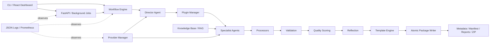

# Architecture

The workflow engine loads a named YAML definition and discovers requested plugins through the registry. The Director runs first and its plan becomes shared specialist context. Research augments that context through the RAG retriever. Each plugin owns its agent-facing schema, processor, validator, scorer, reflector, prompt, and output template.

ProviderManager applies priority-based failover, retry classification, request timeouts, and aggregate token/cost budgets. Validation and quality each allow one targeted regeneration. Reflection may request one improvement, retained only when its score increases. Package material is staged and published only after all gates succeed, preventing partial packages.

The REST layer maintains in-memory background job state, while the dashboard polls it. Production middleware establishes request/correlation context, API-key authentication, rate limiting, safe headers, CORS, structured request logs, and HTTP metrics. Provider and generation paths emit domain-specific Prometheus metrics.

## Runtime boundaries

- Stateless control plane: API routes, workflow orchestration, plugin discovery.
- Stateful runtime data: knowledge embeddings, source documents, output packages, and rotating logs.
- External dependencies: configured LLM providers and optional browser/reverse-proxy infrastructure.
- Scaling note: job state and rate-limit counters are process-local in v1.0. Use one API worker, or introduce shared durable coordination before horizontal scaling.
